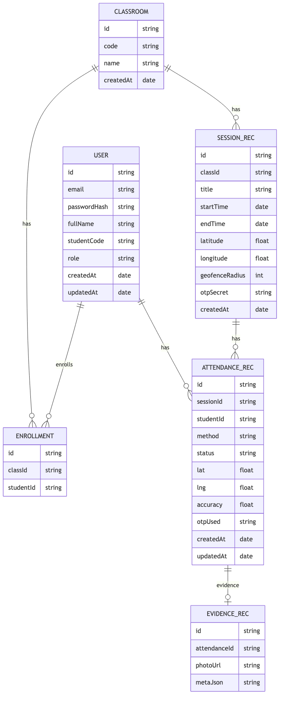

# QR Attendance System

Hệ thống điểm danh bằng QR code với GPS, OTP fallback và ảnh có watermark.


## Kiến trúc

- **Backend**: NestJS, Prisma ORM, PostgreSQL
- **Frontend**: React, Vite, TypeScript
- **Database**: PostgreSQL 16
- **Authentication**: JWT với roles (STUDENT, LECTURER, ADMIN)

## Cài đặt

### Prerequisites

- Node.js 20+
- Docker và Docker Compose

### Khởi động với Docker

```bash
docker compose up -d
```

Services:
- `db`: PostgreSQL (port 5433 trên host)
- `backend`: NestJS API (port 8080)
- `frontend`: React app (port 3000)

### Triển khai production (VPS / domain)

1. Nhân bản file cấu hình mẫu:
   ```bash
   cp env.production.ready .env.production
   ```
2. Chỉnh sửa `.env.production` với thông tin bảo mật riêng:
   - `POSTGRES_*`, `JWT_SECRET`: đổi sang giá trị mạnh, chỉ biết nội bộ
   - `FRONTEND_URL=https://qrattendance.xyz` (hoặc domain chính thức của bạn)
   - `VITE_API_BASE=https://qrattendance.xyz/api` (hoặc endpoint backend công khai)
3. Khởi động stack production:
   ```bash
   docker compose --env-file .env.production -f docker-compose.prod.yml up -d --build
   ```
4. Kiểm tra sau deploy:
   - Frontend: `curl -I https://qrattendance.xyz`
   - Backend health: `curl -I https://qrattendance.xyz/api/health`
5. Nếu dùng reverse proxy/Nginx, tham khảo `docs/CAU_HINH_DOMAIN_HTTPS.md` để cấp HTTPS cho domain mới.

Services (docker-compose.prod.yml):
- `db`: PostgreSQL (port 5432)
- `backend`: NestJS API (port `${BACKEND_PORT:-8080}`)
- `frontend`: React build (port 3000 → 80 trong container, thường được proxy qua Nginx)

## Tài khoản mặc định

- **Admin**: `admin` / `pass123`
- **Lecturer**: `lecturer` / `pass123`
- **Students**: `523H0001` đến `523H0100` / `pass123`

## Tính năng chính

### Sinh viên
- Đăng nhập và quét QR để điểm danh (tự động kiểm tra GPS)
- Điểm danh bằng OTP + ảnh (fallback khi không có GPS)
- Ảnh có watermark: MSSV, mã buổi, OTP, timestamp

### Giảng viên
- Quản lý lớp học và buổi học
- Tạo buổi học với mã công khai (publicCode) dễ nhớ
- QR code tự động rotate mỗi 60s, OTP mỗi 30s
- Xem danh sách điểm danh và ảnh bằng chứng
- Sửa và xóa buổi học

## API chính

- `POST /auth/login` - Đăng nhập
- `POST /sessions` - Tạo buổi học
- `GET /sessions/code/:code` - Lấy buổi học theo publicCode
- `GET /sessions/:id/qr` - Lấy QR token
- `GET /sessions/:id/otp` - Lấy OTP
- `POST /attendance/checkin-qr` - Điểm danh bằng QR
- `POST /attendance/checkin-otp` - Điểm danh bằng OTP

## Database ERD



Xem chi tiết tại [docs/erd-relationships.md](docs/erd-relationships.md)

## Troubleshooting

- **Database**: Kiểm tra container `db` đang chạy: `docker ps`
- **Domain/HTTPS**: Đảm bảo DNS của `qrattendance.xyz` (hoặc domain của bạn) trỏ đúng IP và chứng chỉ SSL còn hạn
- **GPS/Camera**: Cần HTTPS (dùng domain/SSL) và cấp quyền trên mobile browser

## License

MIT
<!-- Đây là comment, sẽ KHÔNG hiển thị -->