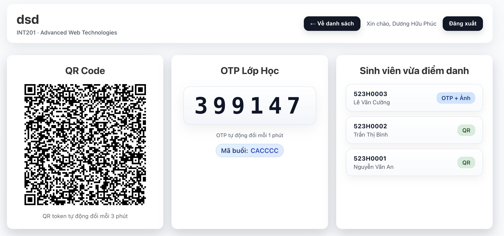
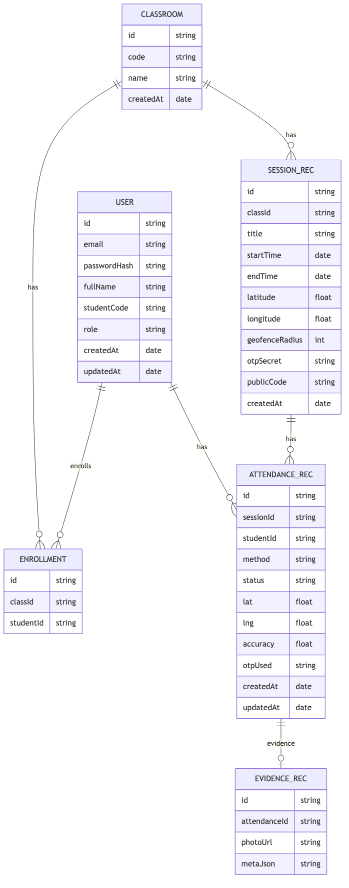

# QR Attendance System

A QR-based attendance system with GPS verification, OTP fallback, and watermarked photos.



## Truy cập dự án

- **Trang web**: http://qrattendance.xyz
- **Backend API**: http://qrattendance.xyz:8080
- **Health check**: http://qrattendance.xyz:8080/health

## Architecture

- **Backend**: NestJS, Prisma ORM, PostgreSQL
- **Frontend**: React, Vite, TypeScript
- **Database**: PostgreSQL 16
- **Authentication**: JWT with roles (STUDENT, LECTURER, ADMIN)

## Setup

### Prerequisites

- Node.js 20+
- Docker and Docker Compose

### Start with Docker

```bash
git clone https://gitlab.duthu.net/523h0054/qrattendance.git
cd qrattendance
docker compose up -d
```

Services:
- `db`: PostgreSQL (port 5433 on host)
- `backend`: NestJS API (port 8080)
- `frontend`: React app (port 3000)

## Default Accounts

- **Admin**: `admin` / `pass123`
- **Lecturer**: `lecturer` / `pass123`
- **Students**: `523H0001` to `523H0100` / `pass123`

## Main Features

### Students
- Log in and scan QR to check in (GPS automatically validated)
- Check in via OTP + photo (fallback when GPS is unavailable)
- Photos include watermark: student ID, session code, OTP, timestamp

### Lecturers
- Manage classes and sessions
- Create sessions with human-friendly public codes (`publicCode`)
- Auto-rotating QR every 60s, OTP every 30s
- View attendance list and evidence photos
- Edit and delete sessions

## Core APIs

- `POST /auth/login` - Login
- `POST /sessions` - Create a session
- `GET /sessions/code/:code` - Get a session by `publicCode`
- `GET /sessions/:id/qr` - Get QR token
- `GET /sessions/:id/otp` - Get OTP
- `POST /attendance/checkin-qr` - Check in via QR
- `POST /attendance/checkin-otp` - Check in via OTP

## Database ERD



See more details in [source_old/docs/erd-relationships.md](source_old/docs/erd-relationships.md)

### Stop the Application

```bash
docker compose down            # Stop, keep data
docker compose down -v         # Stop and delete database
```

## License

MIT
