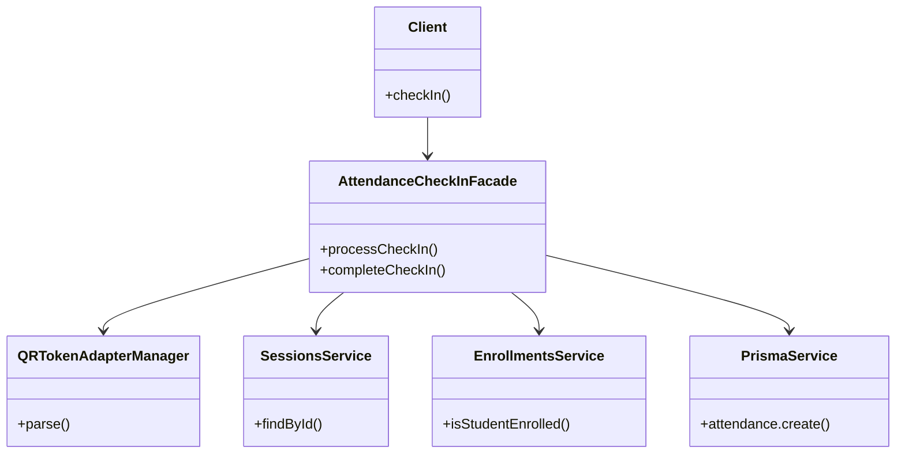

# Facade Pattern - Mẫu Thiết Kế Facade

## 1. Giới thiệu Pattern

**Facade** là một mẫu thiết kế thuộc nhóm **Structural** (Cấu trúc), cung cấp giao diện đơn giản hóa cho một tập hợp các interface phức tạp trong hệ thống. Facade giúp client tương tác với hệ thống một cách dễ dàng hơn mà không cần biết chi tiết bên trong phức tạp.

---

## 2. Bối cảnh áp dụng

Trong hệ thống QR Attendance, khi sinh viên check-in bằng QR code, quy trình bao gồm nhiều bước phức tạp:

1. **Verify QR Token** - Xác thực mã QR (có thể là JWT, JSON, hoặc định dạng khác)
2. **Get Session** - Lấy thông tin buổi học từ database
3. **Check Enrollment** - Kiểm tra sinh viên có đăng ký lớp học không
4. **Calculate Distance** - Tính khoảng cách GPS giữa sinh viên và điểm danh
5. **Create/Update Attendance** - Tạo hoặc cập nhật bản ghi điểm danh

Tất cả logic này tập trung trong `AttendanceService.checkInQR()` ~150 dòng code, gây khó khăn trong bảo trì và test.

---

## 3. Code Cũ (Không dùng Facade)

**File:** `src/attendance/attendance.service.ts`

```typescript
async checkInQR(studentId: string, dto: CheckInQRDto) {
  // Bước 1: Verify QR Token (nhiều định dạng)
  let qrPayload: QRTokenPayload;
  try {
    qrPayload = jwt.verify(dto.qrToken, this.config.get('JWT_SECRET'));
  } catch {
    try {
      qrPayload = JSON.parse(dto.qrToken);
    } catch {
      const parts = dto.qrToken.split('.');
      if (parts.length === 3) {
        qrPayload = { sessionId: parts[0], userId: parts[1], exp: parseInt(parts[2]) };
      } else {
        throw new BadRequestException('Invalid QR token format');
      }
    }
  }

  // Bước 2: Get Session từ database
  const session = await this.prisma.session.findUnique({
    where: { id: qrPayload.sessionId }
  });
  if (!session) {
    throw new NotFoundException('Session not found');
  }

  // Bước 3: Check Enrollment
  const enrollment = await this.prisma.enrollment.findFirst({
    where: { studentId, classId: session.classId }
  });
  if (!enrollment) {
    throw new ForbiddenException('Student not enrolled in this class');
  }

  // Bước 4: Tính khoảng cách GPS
  const distance = this.calculateDistance(
    dto.latitude, dto.longitude,
    session.latitude, session.longitude
  );
  const isInGeofence = distance <= session.geofenceRadius;

  // Bước 5: Create/Update Attendance
  if (!isInGeofence) {
    return {
      success: false,
      status: 'TOO_FAR',
      message: `Bạn đang cách điểm danh ${Math.round(distance)}m (tối đa ${session.geofenceRadius}m)`,
      distance: Math.round(distance)
    };
  }

  const existingAttendance = await this.prisma.attendance.findFirst({
    where: { studentId, sessionId: session.id }
  });

  if (existingAttendance) {
    return { success: true, status: 'ALREADY_CHECKED', message: 'Đã điểm danh trước đó' };
  }

  const attendance = await this.prisma.attendance.create({
    data: {
      studentId,
      sessionId: session.id,
      status: 'APPROVED',
      checkInTime: new Date(),
      method: 'QR'
    }
  });

  return { success: true, status: 'APPROVED', message: 'Điểm danh thành công', attendance };
}
```

---

## 4. Code Mới (Sử dụng Facade)

**File:** `src/attendance/facades/attendance-checkin.facade.ts`

```typescript
import { Injectable } from '@nestjs/common';
import { QRTokenAdapterManager } from '../../common/utils/qr-token-adapter';
import { SessionsService } from '../../sessions/sessions.service';
import { EnrollmentsService } from '../../enrollments/enrollments.service';
import { PrismaService } from '../../prisma/prisma.service';
import { haversineDistance } from '../../common/utils/geography.util';

export interface CheckInResult {
  success: boolean;
  status: 'APPROVED' | 'TOO_FAR' | 'ALREADY_CHECKED' | 'NOT_ENROLLED';
  message: string;
  distance?: number;
  attendance?: any;
}

@Injectable()
export class AttendanceCheckInFacade {
  constructor(
    private qrTokenAdapter: QRTokenAdapterManager,
    private sessionsService: SessionsService,
    private enrollmentsService: EnrollmentsService,
    private prisma: PrismaService,
  ) {}

  async processCheckIn(qrToken: string, studentId: string): Promise<CheckInResult> {
    // Bước 1: Parse QR Token
    const qrPayload = this.qrTokenAdapter.parse(qrToken);

    // Bước 2: Get Session
    const session = await this.sessionsService.findById(qrPayload.sessionId);

    // Bước 3: Check Enrollment
    const isEnrolled = await this.enrollmentsService.isStudentEnrolled(studentId, session.classId);
    if (!isEnrolled) {
      return { success: false, status: 'NOT_ENROLLED', message: 'Bạn chưa đăng ký lớp học này' };
    }

    return { success: true, status: 'ENROLLED', message: 'Đủ điều kiện điểm danh' };
  }

  async completeCheckIn(
    studentId: string,
    qrToken: string,
    latitude: number,
    longitude: number
  ): Promise<CheckInResult> {
    const qrPayload = this.qrTokenAdapter.parse(qrToken);
    const session = await this.sessionsService.findById(qrPayload.sessionId);
    
    // Tính khoảng cách GPS
    const distance = haversineDistance(
      latitude, longitude,
      session.latitude, session.longitude
    );
    const isInGeofence = distance <= session.geofenceRadius;

    if (!isInGeofence) {
      return {
        success: false,
        status: 'TOO_FAR',
        message: `Bạn đang cách điểm danh ${Math.round(distance)}m`,
        distance: Math.round(distance)
      };
    }

    // Kiểm tra đã điểm danh chưa
    const existingAttendance = await this.prisma.attendance.findFirst({
      where: { studentId, sessionId: session.id }
    });

    if (existingAttendance) {
      return { success: true, status: 'ALREADY_CHECKED', message: 'Đã điểm danh trước đó' };
    }

    // Tạo bản ghi điểm danh
    const attendance = await this.prisma.attendance.create({
      data: {
        studentId,
        sessionId: session.id,
        status: 'APPROVED',
        checkInTime: new Date(),
        method: 'QR'
      }
    });

    return { success: true, status: 'APPROVED', message: 'Điểm danh thành công', attendance };
  }
}
```

---

## 5. Giải thích tại sao áp dụng Facade

### Vấn đề gặp phải:
- Method `checkInQR` trong AttendanceService quá dài (~150 dòng)
- Chịu trách nhiệm quá nhiều việc (violation of Single Responsibility Principle)
- Khó test từng bước riêng lẻ
- Khi cần sửa một bước, phải đọc toàn bộ method

### Giải pháp Facade:
- Tạo Facade class riêng để orchestrate các bước check-in
- Mỗi bước được xử lý bởi service chuyên biệt
- Client chỉ cần gọi một method duy nhất

---

## 6. Lợi ích của Facade Pattern

| Tiêu chí | Trước khi dùng Facade | Sau khi dùng Facade |
|----------|----------------------|---------------------|
| **Độ dài method** | ~150 dòng | ~30 dòng |
| **Khả năng test** | Khó test từng bước | Dễ dàng test từng bước |
| **Bảo trì** | Khó sửa đổi | Dễ dàng sửa đổi từng bước |
| **Tái sử dụng** | Không | Có thể tái sử dụng các service |
| **Độ phức tạp** | Cao với client | Thấp với client |

### Các lợi ích cụ thể:

1. **Giảm độ phức tạp cho Client**
   - Client chỉ cần gọi `facade.processCheckIn()` thay vì gọi nhiều service

2. **Tách biệt trách nhiệm**
   - Facade không chứa logic nghiệp vụ, chỉ orchestrate các bước

3. **Dễ dàng mở rộng**
   - Thêm/bớt bước không ảnh hưởng đến client

4. **Tăng khả năng bảo trì**
   - Mỗi service có trách nhiệm rõ ràng

---

## 7. Sơ đồ Class



---

## 8. Kết luận

Facade Pattern giúp đơn giản hóa việc tương tác với các subsystem phức tạp. Trong hệ thống QR Attendance, Facade cho phép:

- ✅ Tách biệt rõ ràng giữa orchestration và business logic
- ✅ Dễ dàng test từng thành phần
- ✅ Code gọn gàng, dễ đọc
- ✅ Dễ dàng mở rộng khi cần thêm tính năng

**Khuyến nghị:** Sử dụng Facade khi hệ thống có nhiều service phối hợp với nhau và client cần gọi nhiều bước để hoàn thành một tác vụ.

