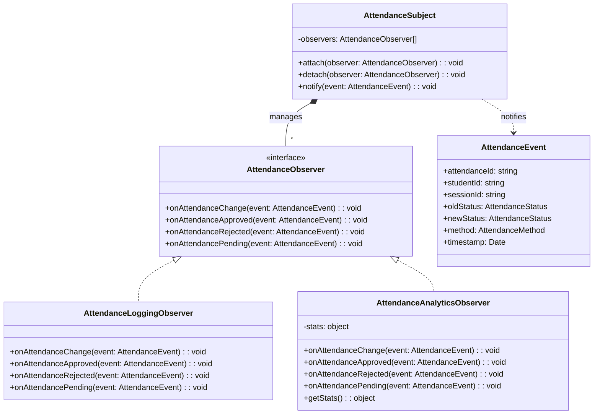

# Observer Pattern - Mẫu Thiết Kế Observer

## 1. Giới thiệu Pattern

**Observer** là mẫu thiết kế thuộc nhóm **Behavioral** (Hành vi), định nghĩa mối phụ thuộc một-nhiều giữa các đối tượng để khi một đối tượng thay đổi trạng thái, tất cả các đối tượng phụ thuộc sẽ được thông báo và cập nhật tự động.

---

## 2. Bối cảnh áp dụng

Trong hệ thống QR Attendance, khi có sự kiện điểm danh:
- Sinh viên check-in → Cập nhật thống kê
- Giảng viên duyệt/từ chối → Ghi log hoạt động
- Trạng thái thay đổi → Cập nhật analytics

Cần một cơ chế để các thành phần khác "lắng nghe" sự kiện này mà không làm phức tạp hóa AttendanceService.

---

## 3. Code Cũ (Không dùng Observer)

**File:** `src/attendance/attendance.service.ts`

```typescript
async approveAttendance(id: string) {
  // Logic approve
  const attendance = await this.prisma.attendance.update({
    where: { id },
    data: { status: AttendanceStatus.APPROVED }
  });

  // Xử lý analytics thủ công - vi phạm SRP
  this.totalApproved++;
  console.log(`[APPROVED] Total approved: ${this.totalApproved}`);

  // Xử lý logging thủ công
  console.log(`[ATTENDANCE] ${attendance.studentId} approved`);

  return attendance;
}

async rejectAttendance(id: string) {
  const attendance = await this.prisma.attendance.update({
    where: { id },
    data: { status: AttendanceStatus.REJECTED }
  });

  // Lặp lại logic
  this.totalRejected++;
  console.log(`[REJECTED] Total rejected: ${this.totalRejected}`);
  console.log(`[ATTENDANCE] ${attendance.studentId} rejected`);

  return attendance;
}
```

---

## 4. Code Mới (Sử dụng Observer)

**File:** `src/attendance/observers/attendance-observer.ts`

```typescript
import { Inject, Injectable } from '@nestjs/common';
import { AttendanceMethod, AttendanceStatus } from '@prisma/client';

export const ATTENDANCE_OBSERVERS = 'ATTENDANCE_OBSERVERS';

export interface AttendanceEvent {
  attendanceId: string;
  studentId: string;
  sessionId: string;
  oldStatus: AttendanceStatus | null;
  newStatus: AttendanceStatus;
  method: AttendanceMethod;
  timestamp: Date;
}

/**
 * Observer Interface
 */
export interface AttendanceObserver {
  onAttendanceChange(event: AttendanceEvent): Promise<void>;
  onAttendanceApproved(event: AttendanceEvent): Promise<void>;
  onAttendanceRejected(event: AttendanceEvent): Promise<void>;
  onAttendancePending(event: AttendanceEvent): Promise<void>;
}

/**
 * Logging Observer - Ghi log hoạt động điểm danh
 */
@Injectable()
export class AttendanceLoggingObserver implements AttendanceObserver {
  async onAttendanceChange(event: AttendanceEvent): Promise<void> {
    console.log(`[ATTENDANCE] ${event.studentId} - ${event.oldStatus} -> ${event.newStatus}`);
  }

  async onAttendanceApproved(event: AttendanceEvent): Promise<void> {
    console.log(`[APPROVED] Attendance ${event.attendanceId} approved for session ${event.sessionId}`);
  }

  async onAttendanceRejected(event: AttendanceEvent): Promise<void> {
    console.log(`[REJECTED] Attendance ${event.attendanceId} rejected for session ${event.sessionId}`);
  }

  async onAttendancePending(event: AttendanceEvent): Promise<void> {
    console.log(`[PENDING] Attendance ${event.attendanceId} pending approval for session ${event.sessionId}`);
  }
}

/**
 * Analytics Observer - Cập nhật thống kê
 */
@Injectable()
export class AttendanceAnalyticsObserver implements AttendanceObserver {
  private stats = {
    total: 0,
    approved: 0,
    rejected: 0,
    pending: 0,
  };

  async onAttendanceChange(event: AttendanceEvent): Promise<void> {
    this.stats.total++;
  }

  async onAttendanceApproved(event: AttendanceEvent): Promise<void> {
    this.stats.approved++;
    console.log(`[ANALYTICS] Total approved: ${this.stats.approved}`);
  }

  async onAttendanceRejected(event: AttendanceEvent): Promise<void> {
    this.stats.rejected++;
    console.log(`[ANALYTICS] Total rejected: ${this.stats.rejected}`);
  }

  async onAttendancePending(event: AttendanceEvent): Promise<void> {
    this.stats.pending++;
    console.log(`[ANALYTICS] Total pending: ${this.stats.pending}`);
  }

  getStats() {
    return { ...this.stats };
  }
}

/**
 * Subject - Quản lý danh sách observers
 */
@Injectable()
export class AttendanceSubject {
  private observers: AttendanceObserver[] = [];

  constructor(
    @Inject(ATTENDANCE_OBSERVERS) observers: AttendanceObserver[] = [],
  ) {
    this.observers = [...new Set(observers)];
  }

  attach(observer: AttendanceObserver): void {
    if (!this.observers.includes(observer)) {
      this.observers.push(observer);
    }
  }

  detach(observer: AttendanceObserver): void {
    const index = this.observers.indexOf(observer);
    if (index > -1) {
      this.observers.splice(index, 1);
    }
  }

  async notify(event: AttendanceEvent): Promise<void> {
    await Promise.all(
      this.observers.map(async (observer) => {
        try {
          await observer.onAttendanceChange(event);

          switch (event.newStatus) {
            case AttendanceStatus.APPROVED:
              await observer.onAttendanceApproved(event);
              break;
            case AttendanceStatus.REJECTED:
              await observer.onAttendanceRejected(event);
              break;
            case AttendanceStatus.PENDING:
              await observer.onAttendancePending(event);
              break;
          }
        } catch (error) {
          console.error(`[ERROR] Observer notification failed:`, error);
        }
      }),
    );
  }
}
```

---

## 5. Cách sử dụng trong AttendanceService

**File:** `src/attendance/attendance.service.ts`

```typescript
import {
  AttendanceEvent,
  AttendanceSubject,
} from './observers/attendance-observer';

@Injectable()
export class AttendanceService {
  constructor(
    private prisma: PrismaService,
    private subject: AttendanceSubject,
  ) {}

  private async publishAttendanceEvent(
    event: Omit<AttendanceEvent, 'timestamp'> & { timestamp?: Date },
  ) {
    await this.subject.notify({
      ...event,
      timestamp: event.timestamp ?? new Date(),
    });
  }

  async approveAttendance(attendanceId: string) {
    const [existing, att] = await this.$transaction([
      this.prisma.attendance.findUnique({ where: { id: attendanceId }, select: { status: true } }),
      this.prisma.attendance.update({
        where: { id: attendanceId },
        data: { status: AttendanceStatus.APPROVED },
      }),
    ]);

    // Thông báo cho tất cả observers
    await this.publishAttendanceEvent({
      attendanceId: att.id,
      studentId: att.studentId,
      sessionId: att.sessionId,
      oldStatus: existing?.status ?? null,
      newStatus: AttendanceStatus.APPROVED,
      method: att.method,
    });

    return att;
  }

  async rejectAttendance(attendanceId: string) {
    const [existing, att] = await this.$transaction([
      this.prisma.attendance.findUnique({ where: { id: attendanceId }, select: { status: true } }),
      this.prisma.attendance.update({
        where: { id: attendanceId },
        data: { status: AttendanceStatus.REJECTED },
      }),
    ]);

    await this.publishAttendanceEvent({
      attendanceId: att.id,
      studentId: att.studentId,
      sessionId: att.sessionId,
      oldStatus: existing?.status ?? null,
      newStatus: AttendanceStatus.REJECTED,
      method: att.method,
    });

    return att;
  }
}
```

**File:** `src/attendance/attendance.module.ts`

```typescript
import { Module } from '@nestjs/common';
import {
  ATTENDANCE_OBSERVERS,
  AttendanceLoggingObserver,
  AttendanceAnalyticsObserver,
  AttendanceSubject,
} from './observers/attendance-observer';

@Module({
  providers: [
    AttendanceLoggingObserver,
    AttendanceAnalyticsObserver,
    {
      provide: ATTENDANCE_OBSERVERS,
      useFactory: (
        loggingObserver: AttendanceLoggingObserver,
        analyticsObserver: AttendanceAnalyticsObserver,
      ) => [loggingObserver, analyticsObserver],
      inject: [AttendanceLoggingObserver, AttendanceAnalyticsObserver],
    },
    AttendanceSubject,
  ],
})
export class AttendanceModule {}
```

---

## 6. Giải thích tại sao áp dụng Observer

### Vấn đề gặp phải:
- AttendanceService phải xử lý logging, analytics cùng lúc
- Vi phạm Single Responsibility Principle
- Khó thêm/bớt tính năng thông báo
- Khó test vì phụ thuộc nhiều service

### Giải pháp Observer:
- Tách logic thông báo ra các Observer riêng biệt
- AttendanceService chỉ cần gọi subject.notify()
- Thêm observer mới không cần sửa code cũ

---

## 7. Lợi ích của Observer Pattern

| Tiêu chí | Trước khi dùng Observer | Sau khi dùng Observer |
|----------|------------------------|---------------------|
| **SRP** | Vi phạm - Service làm quá nhiều việc | Tuân thủ - Mỗi observer một việc |
| **Thêm tính năng** | Sửa AttendanceService | Thêm Observer mới |
| **Bớt tính năng** | Xóa code trong Service | Gỡ Observer |
| **Test** | Khó mock nhiều dependency | Dễ test từng Observer |
| **Coupling** | Cao (tight coupling) | Thấp (loose coupling) |

### Các lợi ích cụ thể:

1. **Loose Coupling**
   - Subject và Observer không biết về nhau

2. **Dễ mở rộng**
   - Thêm observer mới không ảnh hưởng code cũ

3. **Dễ bảo trì**
   - Mỗi observer có trách nhiệm rõ ràng

4. **Dễ test**
   - Test từng observer độc lập

---

## 8. Sơ đồ Class



---

## 9. Kết luận

Observer Pattern giúp tách biệt logic nghiệp vụ khỏi logic thông báo:

- ✅ Tuân thủ Single Responsibility Principle
- ✅ Dễ dàng thêm/bớt tính năng thông báo
- ✅ Code gọn gàng, dễ bảo trì
- ✅ Dễ test từng thành phần

**Khuyến nghị:** Sử dụng Observer khi một thay đổi cần thông báo cho nhiều thành phần khác nhau mà không muốn chúng coupled chặt với nhau.
