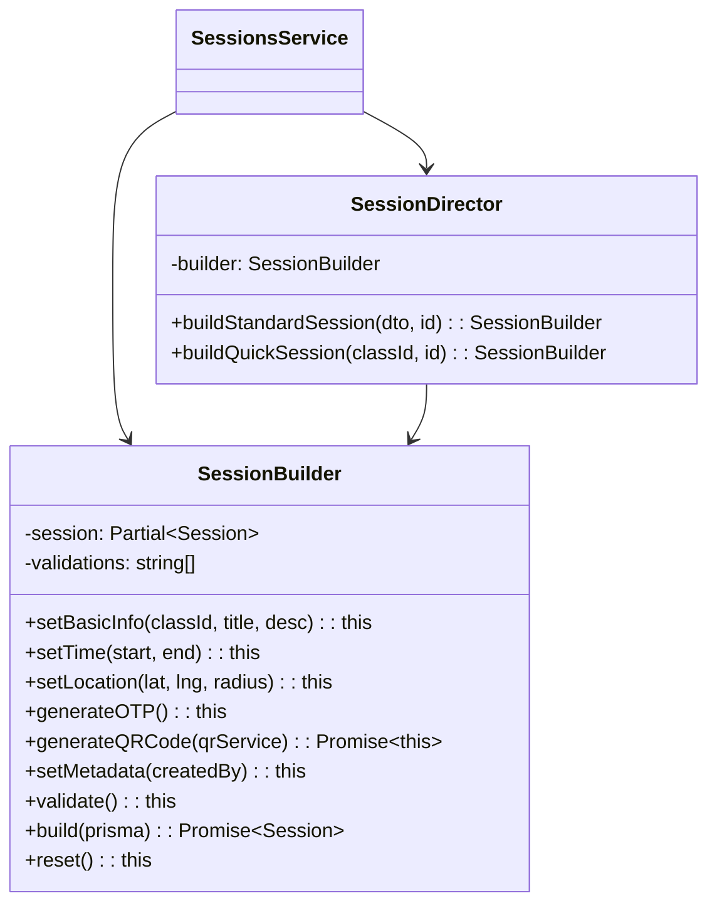

# Builder Pattern - Mẫu Thiết Kế Builder

## 1. Giới thiệu Pattern

**Builder** là mẫu thiết kế thuộc nhóm **Creational** (Khởi tạo), cho phép xây dựng đối tượng phức tạp từng bước một. Builder tách biệt việc khởi tạo đối tượng khỏi biểu diễn của nó, cho phép cùng một quá trình xây dựng tạo ra các biểu diễn khác nhau.

---

## 2. Bối cảnh áp dụng

Trong hệ thống QR Attendance, khi tạo một Session (buổi học), cần thiết lập nhiều thuộc tính:
- Thông tin cơ bản: classId, title, description
- Thời gian: startTime, endTime
- Vị trí: latitude, longitude, geofenceRadius
- Bảo mật: otpSecret, qrCode
- Trạng thái: isActive, createdBy

Logic tạo session phức tạp, nhiều validation và xử lý lồng nhau.

---

## 3. Code Cũ (Không dùng Builder)

**File:** `src/sessions/sessions.service.ts`

```typescript
async createSession(dto: CreateSessionDto, lecturerId: string) {
  // Validation
  if (new Date(dto.startTime) >= new Date(dto.endTime)) {
    throw new BadRequestException('Start time must be before end time');
  }

  // Generate OTP
  const otpSecret = authenticator.generateSecret();
  const otpCode = authenticator.generate(otpSecret);

  // Generate QR Code
  const qrData = JSON.stringify({
    sessionId: '',
    otp: otpCode,
    exp: Date.now() + 3600000
  });
  const qrCode = await this.qrCodeService.generate(qrData);

  // Tạo session
  const session = await this.prisma.session.create({
    data: {
      classId: dto.classId,
      title: dto.title,
      description: dto.description,
      startTime: new Date(dto.startTime),
      endTime: new Date(dto.endTime),
      latitude: dto.latitude,
      longitude: dto.longitude,
      geofenceRadius: dto.geofenceRadius || 100,
      otpSecret,
      otpCode,
      qrCode,
      createdBy: lecturerId,
      isActive: true
    }
  });

  // Cập nhật QR data với session ID
  const updatedQrData = JSON.stringify({
    sessionId: session.id,
    otp: otpCode,
    exp: Date.now() + 3600000
  });
  const updatedQrCode = await this.qrCodeService.generate(updatedQrData);
  
  return await this.prisma.session.update({
    where: { id: session.id },
    data: { qrCode: updatedQrCode }
  });
}

// Method tạo session khác (ví dụ: auto-generate)
async createAutoSession(dto: AutoCreateSessionDto) {
  const otpSecret = authenticator.generateSecret();
  const otpCode = authenticator.generate(otpSecret);
  // ... lặp lại logic tương tự
}
```

---

## 4. Code Mới (Sử dụng Builder)

**File:** `src/sessions/builders/session.builder.ts`

```typescript
import { Injectable } from '@nestjs/common';
import { authenticator } from 'otplib';
import { Session, Prisma } from '@prisma/client';

export interface SessionBuildResult {
  session: Partial<Session>;
  validationErrors: string[];
}

@Injectable()
export class SessionBuilder {
  private session: Partial<Session> = {};
  private validations: string[] = [];

  // ============ Bước 1: Thiết lập thông tin cơ bản ============
  setBasicInfo(classId: string, title: string, description?: string): this {
    this.session.classId = classId;
    this.session.title = title;
    this.session.description = description;
    return this;
  }

  // ============ Bước 2: Thiết lập thời gian ============
  setTime(startTime: Date | string, endTime: Date | string): this {
    const start = new Date(startTime);
    const end = new Date(endTime);
    
    if (start >= end) {
      this.validations.push('Start time must be before end time');
    }
    
    this.session.startTime = start;
    this.session.endTime = end;
    return this;
  }

  // ============ Bước 3: Thiết lập vị trí ============
  setLocation(latitude: number, longitude: number, geofenceRadius?: number): this {
    if (latitude < -90 || latitude > 90) {
      this.validations.push('Invalid latitude');
    }
    if (longitude < -180 || longitude > 180) {
      this.validations.push('Invalid longitude');
    }
    
    this.session.latitude = latitude;
    this.session.longitude = longitude;
    this.session.geofenceRadius = geofenceRadius || 100;
    return this;
  }

  // ============ Bước 4: Generate OTP ============
  generateOTP(): this {
    this.session.otpSecret = authenticator.generateSecret();
    this.session.otpCode = authenticator.generate(this.session.otpSecret);
    return this;
  }

  // ============ Bước 5: Generate QR Code ============
  async generateQRCode(qrService: any): Promise<this> {
    const qrData = JSON.stringify({
      sessionId: '', // sẽ cập nhật sau
      otp: this.session.otpCode,
      exp: Date.now() + 3600000
    });
    this.session.qrCode = await qrService.generate(qrData);
    return this;
  }

  // ============ Bước 6: Thiết lập metadata ============
  setMetadata(createdBy: string, isActive: boolean = true): this {
    this.session.createdBy = createdBy;
    this.session.isActive = isActive;
    return this;
  }

  // ============ Bước 7: Validate ============
  validate(): this {
    // Validate classId
    if (!this.session.classId) {
      this.validations.push('Class ID is required');
    }
    // Validate title
    if (!this.session.title) {
      this.validations.push('Title is required');
    }
    // Validate location
    if (this.session.latitude === undefined || this.session.longitude === undefined) {
      this.validations.push('Location is required');
    }
    return this;
  }

  // ============ Bước 8: Build ============
  getResult(): SessionBuildResult {
    return {
      session: { ...this.session },
      validationErrors: [...this.validations]
    };
  }

  async build(prisma: any): Promise<Session> {
    this.validate();
    
    if (this.validations.length > 0) {
      throw new Error(`Validation failed: ${this.validations.join(', ')}`);
    }

    return await prisma.session.create({
      data: this.session as Prisma.SessionCreateInput
    });
  }

  // ============ Reset ============
  reset(): this {
    this.session = {};
    this.validations = [];
    return this;
  }
}

// ============ Director (Optional) ============
@Injectable()
export class SessionDirector {
  constructor(private builder: SessionBuilder) {}

  buildStandardSession(dto: CreateSessionDto, lecturerId: string): SessionBuilder {
    return this.builder
      .setBasicInfo(dto.classId, dto.title, dto.description)
      .setTime(dto.startTime, dto.endTime)
      .setLocation(dto.latitude, dto.longitude, dto.geofenceRadius)
      .generateOTP()
      .setMetadata(lecturerId);
  }

  buildQuickSession(classId: string, lecturerId: string): SessionBuilder {
    const now = new Date();
    const end = new Date(now.getTime() + 90 * 60000); // 90 phút
    
    return this.builder
      .setBasicInfo(classId, `Session ${now.toISOString()}`)
      .setTime(now, end)
      .setLocation(0, 0, 100) // Default location
      .generateOTP()
      .setMetadata(lecturerId);
  }
}
```

---

## 5. Cách sử dụng

```typescript
// Trong SessionsService
import { SessionBuilder, SessionDirector } from './builders/session.builder';

@Injectable()
export class SessionsService {
  constructor(
    private sessionBuilder: SessionBuilder,
    private sessionDirector: SessionDirector,
    private qrCodeService: QRCodeService
  ) {}

  async createSession(dto: CreateSessionDto, lecturerId: string) {
    // Cách 1: Sử dụng Builder trực tiếp
    const session = await this.sessionBuilder
      .setBasicInfo(dto.classId, dto.title, dto.description)
      .setTime(dto.startTime, dto.endTime)
      .setLocation(dto.latitude, dto.longitude, dto.geofenceRadius)
      .generateOTP()
      .setMetadata(lecturerId)
      .build(this.prisma);
    
    return session;
  }

  async createQuickSession(classId: string, lecturerId: string) {
    // Cách 2: Sử dụng Director
    const builder = this.sessionDirector.buildQuickSession(classId, lecturerId);
    return await builder.build(this.prisma);
  }
}
```

---

## 6. Giải thích tại sao áp dụng Builder

### Vấn đề gặp phải:
- Method tạo session quá dài (~50 dòng)
- Nhiều validation và xử lý lồng nhau
- Khó tạo session với các biến thể khác nhau
- Khó test từng bước

### Giải pháp Builder:
- Tách thành các bước nhỏ, mỗi bước một method
- Dễ dàng tạo biến thể với Director
- Validation được phân tán
- Dễ test từng bước

---

## 7. Lợi ích của Builder Pattern

| Tiêu chí | Trước khi dùng Builder | Sau khi dùng Builder |
|----------|----------------------|---------------------|
| **Độ dài method** | ~50 dòng | Mỗi bước ~5 dòng |
| **Tái sử dụng** | Khó | Dễ dàng với Director |
| **Test** | Khó test từng bước | Test từng bước dễ dàng |
| **Đọc code** | Khó hiểu | Code gần như ngôn ngữ tự nhiên |
| **Biến thể** | Phải viết method mới | Tạo Director mới |

### Các lợi ích cụ thể:

1. **Fluency**
   - Code đọc như câu tiếng Anh

2. **Immutability**
   - Builder có thể tạo đối tượng immutable

3. **Reusability**
   - Tái sử dụng Builder cho nhiều use case

4. **Step-by-step validation**
   - Validate từng bước, hiển lỗi ngay

---

## 8. Sơ đồ Class



---

## 9. Kết luận

Builder Pattern giúp xây dựng đối tượng phức tạp một cách có hệ thống:

- ✅ Code gọn gàng, dễ đọc như ngôn ngữ tự nhiên
- ✅ Dễ dàng tạo các biến thể với Director
- ✅ Validation từng bước, hiển lỗi ngay
- ✅ Dễ test và bảo trì

**Khuyến nghị:** Sử dụng Builder khi đối tượng có nhiều thuộc tính và logic khởi tạo phức tạp.

