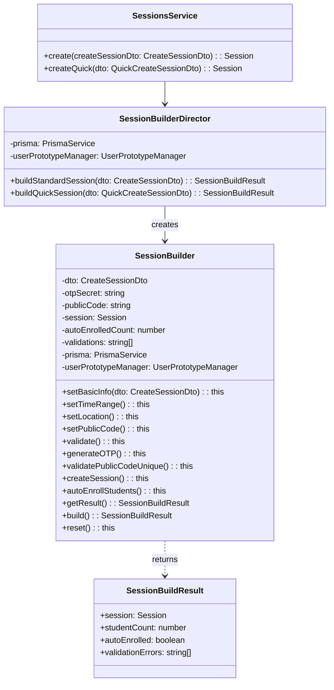

# Builder Pattern - Mẫu Thiết Kế Builder

## 1. Giới thiệu Pattern

**Builder** là mẫu thiết kế thuộc nhóm **Creational** (Khởi tạo), cho phép xây dựng đối tượng phức tạp từng bước một. Builder tách biệt việc khởi tạo đối tượng khỏi biểu diễn của nó, cho phép cùng một quá trình xây dựng tạo ra các biểu diễn khác nhau.

---

## 2. Bối cảnh áp dụng

Trong hệ thống QR Attendance, khi tạo một Session (buổi học), cần thiết lập nhiều thuộc tính:
- Thông tin cơ bản: classId, title, description
- Thời gian: startTime, endTime
- Vị trí: latitude, longitude, geofenceRadius
- Bảo mật: otpSecret, publicCode
- Validation và auto-enroll sinh viên

Logic tạo session phức tạp, nhiều validation và xử lý lồng nhau.

---

## 3. Code Cũ (Không dùng Builder)

**File:** `src/sessions/sessions.service.ts`

```typescript
async createSession(dto: CreateSessionDto) {
  // Validation
  if (new Date(dto.startTime) >= new Date(dto.endTime)) {
    throw new BadRequestException('Start time must be before end time');
  }

  // Validate location
  if (dto.latitude < -90 || dto.latitude > 90) {
    throw new BadRequestException('Invalid latitude');
  }

  // Generate OTP
  const otpSecret = authenticator.generateSecret();

  // Validate publicCode unique
  const existing = await this.prisma.session.findFirst({
    where: { publicCode: dto.publicCode }
  });
  if (existing) {
    throw new BadRequestException('Public code already exists');
  }

  // Create session
  const session = await this.prisma.session.create({
    data: {
      classId: dto.classId,
      title: dto.title,
      startTime: new Date(dto.startTime),
      endTime: new Date(dto.endTime),
      latitude: dto.latitude,
      longitude: dto.longitude,
      geofenceRadius: dto.geofenceRadius,
      otpSecret,
      publicCode: dto.publicCode,
    }
  });

  // Auto-enroll students - lặp lại code
  const students = await this.prisma.user.findMany({
    where: { role: 'STUDENT' }
  });
  // ... enroll logic

  return session;
}
```

---

## 4. Code Mới (Sử dụng Builder)

**File:** `src/sessions/builders/session.builder.ts`

```typescript
import { Injectable, BadRequestException } from '@nestjs/common';
import { authenticator } from 'otplib';
import { AttendanceMethod, AttendanceStatus, Session } from '@prisma/client';
import { PrismaService } from '../../common/prisma/prisma.service';
import { CreateSessionDto } from '../dto/create-session.dto';
import { QuickCreateSessionDto } from '../dto/quick-create-session.dto';
import { UserPrototypeManager } from '../../users/prototypes/user.prototype';

export interface SessionBuildResult {
  session: Session;
  studentCount: number;
  autoEnrolled: boolean;
  validationErrors: string[];
}

class SessionBuilder {
  private dto!: CreateSessionDto;
  private otpSecret = '';
  private publicCode = '';
  private session?: Session;
  private autoEnrolledCount = 0;
  private validations: string[] = [];

  constructor(
    private readonly prisma: PrismaService,
    private readonly userPrototypeManager: UserPrototypeManager,
  ) {}

  setBasicInfo(dto: CreateSessionDto): this {
    this.dto = dto;
    return this;
  }

  setTimeRange(): this {
    const start = new Date(this.dto.startTime);
    const end = new Date(this.dto.endTime);

    if (start >= end) {
      this.validations.push('Thời gian bắt đầu phải nhỏ hơn thời gian kết thúc');
    }

    return this;
  }

  setLocation(): this {
    if (this.dto.latitude < -90 || this.dto.latitude > 90) {
      this.validations.push('Vĩ độ không hợp lệ');
    }
    if (this.dto.longitude < -180 || this.dto.longitude > 180) {
      this.validations.push('Kinh độ không hợp lệ');
    }
    return this;
  }

  setPublicCode(): this {
    this.publicCode = (this.dto.publicCode || '').trim().toUpperCase();
    if (!this.publicCode) {
      this.validations.push('Mã buổi là bắt buộc');
    }
    return this;
  }

  validate(): this {
    if (!this.dto.classId) {
      this.validations.push('Class ID là bắt buộc');
    }
    if (!this.dto.title) {
      this.validations.push('Tiêu đề buổi học là bắt buộc');
    }
    if (this.dto.latitude === undefined || this.dto.longitude === undefined) {
      this.validations.push('Thông tin vị trí là bắt buộc');
    }

    return this;
  }

  generateOTP(): this {
    this.otpSecret = authenticator.generateSecret();
    return this;
  }

  async validatePublicCodeUnique(): Promise<this> {
    if (this.publicCode) {
      const conflict = await this.prisma.session.findFirst({
        where: { publicCode: this.publicCode } as any,
        select: { id: true },
      });

      if (conflict) {
        this.validations.push('Mã buổi đã tồn tại, vui lòng chọn mã khác');
      }
    }

    return this;
  }

  async createSession(): Promise<this> {
    this.session = await this.prisma.session.create({
      data: {
        classId: this.dto.classId,
        title: this.dto.title,
        startTime: new Date(this.dto.startTime),
        endTime: new Date(this.dto.endTime),
        latitude: this.dto.latitude,
        longitude: this.dto.longitude,
        geofenceRadius: this.dto.geofenceRadius,
        otpSecret: this.otpSecret,
        publicCode: this.publicCode,
      } as any,
    });

    return this;
  }

  async autoEnrollStudents(): Promise<this> {
    if (!this.session) {
      throw new BadRequestException('Session chưa được tạo');
    }

    // Lấy danh sách sinh viên mẫu
    const toPadded = (n: number) => n.toString().padStart(4, '0');
    const studentCodes = Array.from(
      { length: 100 },
      (_, i) => `523H${toPadded(i + 1)}`,
    );

    // Tạo users nếu chưa tồn tại (sử dụng Prototype)
    const existingUsers = await this.prisma.user.findMany({
      where: { studentCode: { in: studentCodes } },
      select: { id: true, studentCode: true },
    });

    const existingCodeSet = new Set(
      existingUsers.map((u) => u.studentCode as string),
    );

    const missingCodes = studentCodes.filter(
      (code) => !existingCodeSet.has(code),
    );

    if (missingCodes.length > 0) {
      await this.userPrototypeManager.createBatchStudents(missingCodes);
    }

    // Enroll tất cả sinh viên
    const allUsers = await this.prisma.user.findMany({
      where: { studentCode: { in: studentCodes } },
      select: { id: true, studentCode: true },
    });

    const enrollData = allUsers.map((u) => ({
      classId: this.session.classId,
      studentId: u.id,
    }));
    await this.prisma.enrollment.createMany({
      data: enrollData,
      skipDuplicates: true,
    });

    // Tạo attendance records
    const attendanceData = allUsers.map((u) => ({
      sessionId: this.session.id,
      studentId: u.id,
      method: AttendanceMethod.AUTO_IMPORT,
      status: AttendanceStatus.NOT_ATTENDED,
    }));
    await this.prisma.attendance.createMany({
      data: attendanceData,
      skipDuplicates: true,
    });

    this.autoEnrolledCount = allUsers.length;

    return this;
  }

  getResult(): SessionBuildResult {
    if (!this.session) {
      throw new BadRequestException('Session chưa được tạo');
    }

    return {
      session: this.session,
      studentCount: this.autoEnrolledCount,
      autoEnrolled: true,
      validationErrors: [...this.validations],
    };
  }

  async build(): Promise<SessionBuildResult> {
    this.validate();

    if (this.validations.length > 0) {
      throw new BadRequestException(this.validations.join(', '));
    }

    await this.validatePublicCodeUnique();

    if (this.validations.length > 0) {
      throw new BadRequestException(this.validations.join(', '));
    }

    await this.createSession();
    await this.autoEnrollStudents();

    return this.getResult();
  }

  reset(): this {
    this.dto = undefined as unknown as CreateSessionDto;
    this.otpSecret = '';
    this.publicCode = '';
    this.session = undefined;
    this.autoEnrolledCount = 0;
    this.validations = [];
    return this;
  }
}

@Injectable()
export class SessionBuilderDirector {
  constructor(
    private readonly prisma: PrismaService,
    private readonly userPrototypeManager: UserPrototypeManager,
  ) {}

  async buildStandardSession(dto: CreateSessionDto): Promise<SessionBuildResult> {
    const builder = new SessionBuilder(this.prisma, this.userPrototypeManager);

    try {
      builder
        .setBasicInfo(dto)
        .setTimeRange()
        .setLocation()
        .setPublicCode()
        .generateOTP();
      return await builder.build();
    } finally {
      builder.reset();
    }
  }

  async buildQuickSession(dto: QuickCreateSessionDto): Promise<SessionBuildResult> {
    const builder = new SessionBuilder(this.prisma, this.userPrototypeManager);
    const now = new Date();
    const durationMinutes = dto.durationMinutes ?? 90;
    const end = new Date(now.getTime() + durationMinutes * 60000);
    const title = dto.title?.trim() || `Session ${now.toISOString()}`;
    const quickDto: CreateSessionDto = {
      classId: dto.classId,
      title,
      startTime: now.toISOString(),
      endTime: end.toISOString(),
      latitude: dto.latitude ?? 0,
      longitude: dto.longitude ?? 0,
      geofenceRadius: dto.geofenceRadius ?? 100,
      publicCode: (dto.publicCode || this.generateQuickPublicCode()).toUpperCase(),
    };

    try {
      builder
        .setBasicInfo(quickDto)
        .setTimeRange()
        .setLocation()
        .setPublicCode()
        .generateOTP();
      return await builder.build();
    } finally {
      builder.reset();
    }
  }

  private generateQuickPublicCode(): string {
    return Math.random().toString(36).slice(2, 8).toUpperCase();
  }
}
```

---

## 5. Cách sử dụng

**File:** `src/sessions/sessions.service.ts`

```typescript
@Injectable()
export class SessionsService {
  constructor(
    private prisma: PrismaService,
    private sessionBuilderDirector: SessionBuilderDirector,
  ) {}

  async create(createSessionDto: CreateSessionDto) {
    const result = await this.sessionBuilderDirector.buildStandardSession(createSessionDto);
    return result.session;
  }

  async createQuick(quickCreateSessionDto: QuickCreateSessionDto) {
    const result = await this.sessionBuilderDirector.buildQuickSession(quickCreateSessionDto);
    return result.session;
  }
}
```

**File:** `src/sessions/sessions.module.ts`

```typescript
@Module({
  imports: [UsersModule],
  providers: [
    SessionsService,
    SessionBuilderDirector,
    UserPrototypeManager,
  ],
  exports: [SessionsService],
})
export class SessionsModule {}
```

---

## 6. Giải thích tại sao áp dụng Builder

### Vấn đề gặp phải:
- Method tạo session quá dài (~80 dòng)
- Nhiều validation và xử lý lồng nhau
- Khó tạo session với các biến thể khác nhau
- Khó test từng bước

### Giải pháp Builder:
- Tách thành các bước nhỏ, mỗi bước một method
- Dễ dàng tạo biến thể với Director
- Validation được phân tán
- Dễ test từng bước

---

## 7. Lợi ích của Builder Pattern

| Tiêu chí | Trước khi dùng Builder | Sau khi dùng Builder |
|----------|----------------------|---------------------|
| **Độ dài method** | ~80 dòng | Mỗi bước ~5 dòng |
| **Tái sử dụng** | Khó | Dễ dàng với Director |
| **Test** | Khó test từng bước | Test từng bước dễ dàng |
| **Đọc code** | Khó hiểu | Code gần như ngôn ngữ tự nhiên |
| **Biến thể** | Phải viết method mới | Tạo Director mới |

### Các lợi ích cụ thể:

1. **Fluency**
   - Code đọc như câu tiếng Anh

2. **Immutability**
   - Builder có thể tạo đối tượng immutable

3. **Reusability**
   - Tái sử dụhiều use case

4.ng Builder cho n **Step-by-step validation**
   - Validate từng bước, hiển lỗi ngay

---

## 8. Sơ đồ Class



---

## 9. Kết luận

Builder Pattern giúp xây dựng đối tượng phức tạp một cách có hệ thống:

- ✅ Code gọn gàng, dễ đọc như ngôn ngữ tự nhiên
- ✅ Dễ dàng tạo các biến thể với Director
- ✅ Validation từng bước, hiển lỗi ngay
- ✅ Dễ test và bảo trì
- ✅ Kết hợp tốt với Prototype Pattern để auto-enroll sinh viên

**Khuyến nghị:** Sử dụng Builder khi đối tượng có nhiều thuộc tính và logic khởi tạo phức tạp.
