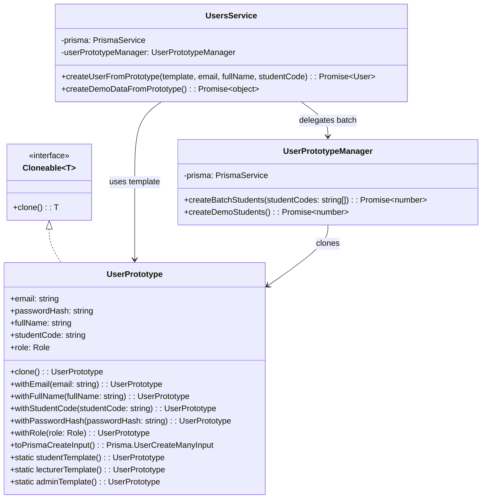

# Prototype Pattern - Mẫu Thiết Kế Prototype

## 1. Giới thiệu Pattern

**Prototype** là mẫu thiết kế thuộc nhóm **Creational** (Khởi tạo), cho phép tạo đối tượng mới bằng cách clone (sao chép) một đối tượng mẫu (prototype) có sẵn thay vì khởi tạo từ đầu. Pattern này đặc biệt hữu ích khi việc tạo đối tượng mới tốn kém về mặt tài nguyên hoặc thời gian.

---

## 2. Bối cảnh áp dụng

Trong hệ thống QR Attendance, khi cần tạo nhiều user mẫu (demo/testing):
- Tạo 100 sinh viên mẫu cho việc demo
- Mỗi sinh viên có các thuộc tính mặc định giống nhau
- Mỗi lần tạo user lặp lại các giá trị default (role, isActive, profile...)

---

## 3. Code Cũ (Không dùng Prototype)

**File:** `src/users/users.service.ts`

```typescript
// Tạo từng user một - lặp lại code
async createStudent(email: string, fullName: string, studentCode: string) {
  return await this.prisma.user.create({
    data: {
      email,
      passwordHash: '',
      fullName,
      studentCode,
      role: 'STUDENT',
    }
  });
}

// Tạo nhiều user mẫu - lặp lại code
async createDemoStudents(count: number) {
  const students = [];
  for (let i = 1; i <= count; i++) {
    const studentCode = `523H${String(i).padStart(4, '0')}`;
    const student = await this.prisma.user.create({
      data: {
        email: `student${studentCode}@test.com`,
        passwordHash: '',
        fullName: `Sinh viên ${studentCode}`,
        studentCode,
        role: 'STUDENT',
      }
    });
    students.push(student);
  }
  return students;
}

// Tạo user cho từng role đều lặp lại
async createLecturer(email: string, fullName: string) {
  return await this.prisma.user.create({
    data: {
      email,
      passwordHash: '',
      fullName,
      role: 'LECTURER',  // Khác STUDENT
    }
  });
}
```

---

## 4. Code Mới (Sử dụng Prototype)

**File:** `src/users/prototypes/user.prototype.ts`

```typescript
import { Injectable } from '@nestjs/common';
import { Prisma, Role } from '@prisma/client';
import { PrismaService } from '../../common/prisma/prisma.service';

export interface Cloneable<T> {
  clone(): T;
}

export class UserPrototype implements Cloneable<UserPrototype> {
  email: string;
  passwordHash: string;
  fullName: string;
  studentCode: string;
  role: Role;

  constructor() {
    this.email = '';
    this.passwordHash = '';
    this.fullName = '';
    this.studentCode = '';
    this.role = Role.STUDENT;
  }

  clone(): UserPrototype {
    return Object.assign(
      Object.create(Object.getPrototypeOf(this)),
      this,
    );
  }

  withEmail(email: string): UserPrototype {
    const next = this.clone();
    next.email = email;
    return next;
  }

  withFullName(fullName: string): UserPrototype {
    const next = this.clone();
    next.fullName = fullName;
    return next;
  }

  withStudentCode(studentCode: string): UserPrototype {
    const next = this.clone();
    next.studentCode = studentCode;
    return next;
  }

  withPasswordHash(passwordHash: string): UserPrototype {
    const next = this.clone();
    next.passwordHash = passwordHash;
    return next;
  }

  withRole(role: Role): UserPrototype {
    const next = this.clone();
    next.role = role;
    return next;
  }

  static studentTemplate(): UserPrototype {
    return new UserPrototype()
      .withRole(Role.STUDENT)
      .withPasswordHash('');
  }

  static lecturerTemplate(): UserPrototype {
    return new UserPrototype()
      .withRole(Role.LECTURER)
      .withPasswordHash('');
  }

  static adminTemplate(): UserPrototype {
    return new UserPrototype()
      .withRole(Role.ADMIN)
      .withPasswordHash('');
  }

  toPrismaCreateInput(): Prisma.UserCreateManyInput {
    return {
      email: this.email,
      passwordHash: this.passwordHash,
      fullName: this.fullName,
      studentCode: this.studentCode,
      role: this.role,
    };
  }
}

@Injectable()
export class UserPrototypeManager {
  constructor(private readonly prisma: PrismaService) {}

  async createBatchStudents(studentCodes: string[]): Promise<number> {
    const template = UserPrototype.studentTemplate();

    const userData = studentCodes.map((studentCode) =>
      template
        .withEmail(`${studentCode.toLowerCase()}@example.edu`)
        .withFullName(`Sinh viên ${studentCode}`)
        .withStudentCode(studentCode)
        .toPrismaCreateInput(),
    );

    await this.prisma.user.createMany({
      data: userData,
      skipDuplicates: true,
    });

    return userData.length;
  }

  async createDemoStudents(): Promise<number> {
    const toPadded = (n: number) => n.toString().padStart(4, '0');
    const studentCodes = Array.from(
      { length: 100 },
      (_, i) => `523H${toPadded(i + 1)}`,
    );

    return this.createBatchStudents(studentCodes);
  }
}
```

---

## 5. Cách sử dụng

**File:** `src/users/users.service.ts`

```typescript
import { UserPrototype, UserPrototypeManager } from './prototypes/user.prototype';

@Injectable()
export class UsersService {
  constructor(
    private prisma: PrismaService,
    private userPrototypeManager: UserPrototypeManager,
  ) {}

  async createUserFromPrototype(
    template: UserPrototype,
    email: string,
    fullName: string,
    studentCode = '',
  ) {
    const user = template
      .clone()
      .withEmail(email)
      .withFullName(fullName)
      .withStudentCode(studentCode);

    return this.prisma.user.create({
      data: user.toPrismaCreateInput() as Prisma.UserCreateInput,
    });
  }

  async createDemoDataFromPrototype() {
    const createdStudents = await this.userPrototypeManager.createDemoStudents();
    return { createdStudents };
  }
}
```

---

## 6. Giải thích tại sao áp dụng Prototype

### Vấn đề gặp phải:
- Lặp lại các giá trị default khi tạo user
- Khó tạo nhanh nhiều user với thuộc tính tương tự
- Code trùng lặp giữa các method createStudent, createLecturer

### Giải pháp Prototype:
- Tạo template có sẵn cho từng role
- Clone và modify chỉ những gì cần thay đổi
- Tạo batch user dễ dàng

---

## 7. Lợi ích của Prototype Pattern

| Tiêu chí | Trước khi dùng Prototype | Sau khi dùng Prototype |
|----------|------------------------|----------------------|
| **Code trùng lặp** | Nhiều | Không có |
| **Tạo batch** | Viết loop thủ công | Dùng UserPrototypeManager |
| **Thay đổi default** | Sửa từng method | Sửa template |
| **Tốc độ phát triển** | Chậm | Nhanh |

### Các lợi ích cụ thể:

1. **Giảm code trùng lặp**
   - Template chứa giá trị mặc định

2. **Tạo đối tượng nhanh**
   - Clone nhanh hơn khởi tạo mới

3. **Dễ thay đổi**
   - Thay đổi template, ảnh hưởng tất cả

4. **Fluency**
   - Code gọn gàng với fluent setters

---

## 8. Sơ đồ Class



---

## 9. Kết luận

Prototype Pattern giúp tạo đối tượng mẫu và clone khi cần:

- ✅ Giảm code trùng lặp đáng kể
- ✅ Tạo batch user nhanh chóng
- ✅ Dễ dàng thay đổi giá trị mặc định
- ✅ Code gọn gàng, dễ đọc

**Khuyến nghị:** Sử dụng Prototype khi cần tạo nhiều đối tượng có thuộc tính tương tự hoặc khi việc khởi tạo đối tượng mới tốn kém.
