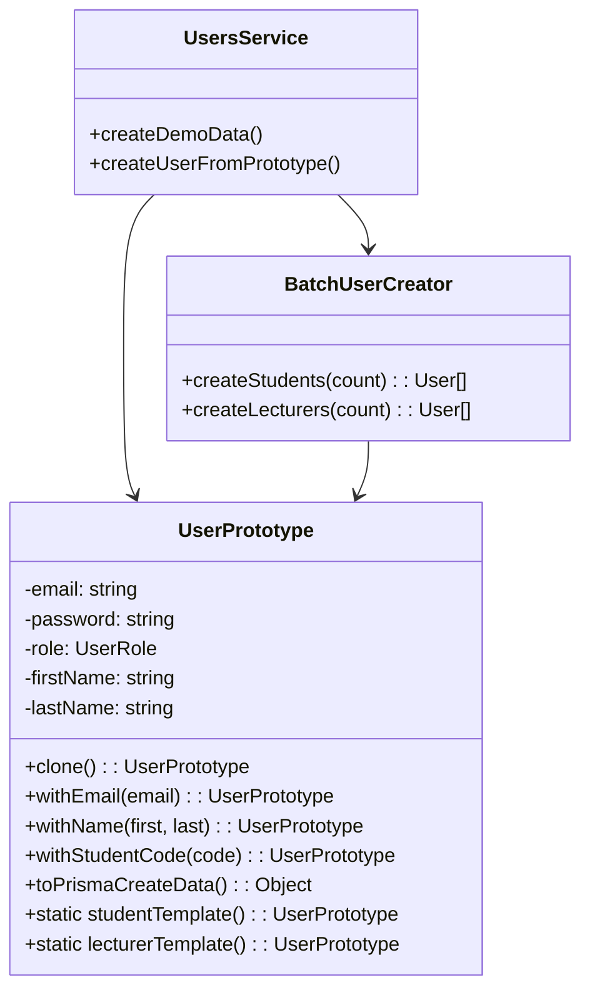

# Prototype Pattern - Mẫu Thiết Kế Prototype

## 1. Giới thiệu Pattern

**Prototype** là mẫu thiết kế thuộc nhóm **Creational** (Khởi tạo), cho phép tạo đối tượng mới bằng cách clone (sao chép) một đối tượng mẫu (prototype) có sẵn thay vì khởi tạo từ đầu. Pattern này đặc biệt hữu ích khi việc tạo đối tượng mới tốn kém về mặt tài nguyên hoặc thời gian.

---

## 2. Bối cảnh áp dụng

Trong hệ thống QR Attendance, khi cần tạo nhiều user mẫu (demo/testing):
- Tạo 100 sinh viên mẫu cho việc demo
- Mỗi sinh viên có các thuộc tính mặc định giống nhau
- Mỗi lần tạo user lặp lại các giá trị default (role, isActive, profile...)

---

## 3. Code Cũ (Không dùng Prototype)

**File:** `src/users/users.service.ts`

```typescript
// Tạo từng user một
async createStudent(email: string, name: string) {
  return await this.prisma.user.create({
    data: {
      email,
      password: await bcrypt.hash('password123', 10),
      role: 'STUDENT',
      isActive: true,
      profile: {
        create: {
          firstName: name.split(' ')[0],
          lastName: name.split(' ').slice(1).join(' '),
          studentCode: '',
          phone: '',
          avatar: ''
        }
      }
    }
  });
}

// Tạo nhiều user mẫu - lặp lại code
async createDemoStudents(count: number) {
  const students = [];
  for (let i = 1; i <= count; i++) {
    const student = await this.prisma.user.create({
      data: {
        email: `student${i}@demo.com`,
        password: await bcrypt.hash('password123', 10),
        role: 'STUDENT',
        isActive: true,
        profile: {
          create: {
            firstName: `Student`,
            lastName: `Number ${i}`,
            studentCode: `SV${String(i).padStart(6, '0')}`,
            phone: '',
            avatar: ''
          }
        }
      }
    });
    students.push(student);
  }
  return students;
}

// Tạo user cho từng role đều lặp lại
async createLecturer(email: string, name: string) {
  return await this.prisma.user.create({
    data: {
      email,
      password: await bcrypt.hash('password123', 10),
      role: 'LECTURER',  // Khác STUDENT
      isActive: true,
      profile: {
        create: {
          firstName: name.split(' ')[0],
          lastName: name.split(' ').slice(1).join(' '),
          employeeCode: `GV${Date.now()}`,
          phone: '',
          avatar: ''
        }
      }
    }
  });
}
```

---

## 4. Code Mới (Sử dụng Prototype)

**File:** `src/users/prototypes/user.prototype.ts`

```typescript
import { User, Profile, UserRole } from '@prisma/client';

// Interface cho cloneable
export interface Cloneable<T> {
  clone(): T;
}

// User Prototype
export class UserPrototype implements Cloneable<UserPrototype> {
  email: string = '';
  password: string = 'password123';
  role: UserRole = 'STUDENT';
  isActive: boolean = true;
  firstName: string = '';
  lastName: string = '';
  studentCode: string = '';
  employeeCode: string = '';
  phone: string = '';
  avatar: string = '';

  // Clone method - sao chép đối tượng
  clone(): UserPrototype {
    return Object.assign(
      Object.create(Object.getPrototypeOf(this)),
      this
    );
  }

  // Fluent setters - trả về clone đã modify
  withEmail(email: string): UserPrototype {
    const clone = this.clone();
    clone.email = email;
    return clone;
  }

  withName(firstName: string, lastName: string): UserPrototype {
    const clone = this.clone();
    clone.firstName = firstName;
    clone.lastName = lastName;
    return clone;
  }

  withStudentCode(code: string): UserPrototype {
    const clone = this.clone();
    clone.studentCode = code;
    return clone;
  }

  withEmployeeCode(code: string): UserPrototype {
    const clone = this.clone();
    clone.employeeCode = code;
    return clone;
  }

  withPassword(password: string): UserPrototype {
    const clone = this.clone();
    clone.password = password;
    return clone;
  }

  // Static factory methods - tạo template có sẵn
  static studentTemplate(): UserPrototype {
    return new UserPrototype()
      .withName('Student', 'Default')
      .withStudentCode('');
  }

  static lecturerTemplate(): UserPrototype {
    return Object.assign(new UserPrototype(), {
      role: 'LECTURER' as UserRole,
      firstName: 'Lecturer',
      lastName: 'Default'
    });
  }

  static adminTemplate(): UserPrototype {
    return Object.assign(new UserPrototype(), {
      role: 'ADMIN' as UserRole,
      firstName: 'Admin',
      lastName: 'Default'
    });
  }

  // Chuyển đổi sang object cho Prisma
  toPrismaCreateData() {
    return {
      email: this.email,
      password: this.password,
      role: this.role,
      isActive: this.isActive,
      profile: {
        create: {
          firstName: this.firstName,
          lastName: this.lastName,
          studentCode: this.studentCode || undefined,
          employeeCode: this.employeeCode || undefined,
          phone: this.phone || undefined,
          avatar: this.avatar || undefined
        }
      }
    };
  }
}

// Batch User Creator
export class BatchUserCreator {
  constructor(private prisma: any) {}

  async createStudents(count: number, baseEmail: string = 'student'): Promise<User[]> {
    const template = UserPrototype.studentTemplate();
    const users: User[] = [];

    for (let i = 1; i <= count; i++) {
      const student = template
        .withEmail(`${baseEmail}${i}@demo.com`)
        .withName('Student', `Number ${i}`)
        .withStudentCode(`SV${String(i).padStart(6, '0')}`);

      users.push(await this.prisma.user.create({
        data: student.toPrismaCreateData()
      }));
    }

    return users;
  }

  async createLecturers(count: number): Promise<User[]> {
    const template = UserPrototype.lecturerTemplate();
    const users: User[] = [];

    for (let i = 1; i <= count; i++) {
      const lecturer = template
        .withEmail(`lecturer${i}@demo.com`)
        .withName('GV', `Number ${i}`)
        .withEmployeeCode(`GV${String(i).padStart(4, '0')}`);

      users.push(await this.prisma.user.create({
        data: lecturer.toPrismaCreateData()
      }));
    }

    return users;
  }
}
```

---

## 5. Cách sử dụng

```typescript
// Trong UsersService
import { UserPrototype, BatchUserCreator } from './prototypes/user.prototype';

@Injectable()
export class UsersService {
  async createDemoData() {
    // Cách 1: Sử dụng template có sẵn
    const studentTemplate = UserPrototype.studentTemplate();
    const student = studentTemplate
      .withEmail('student1@demo.com')
      .withName('Nguyen', 'Van A')
      .withStudentCode('SV001');

    await this.prisma.user.create({ data: student.toPrismaCreateData() });

    // Cách 2: Sử dụng Batch Creator
    const batchCreator = new BatchUserCreator(this.prisma);
    const students = await batchCreator.createStudents(100);
    const lecturers = await batchCreator.createLecturers(5);

    return { students, lecturers };
  }

  // Clone để tạo biến thể
  async createUserFromPrototype(template: UserPrototype, email: string) {
    const user = template.clone().withEmail(email);
    return await this.prisma.user.create({ data: user.toPrismaCreateData() });
  }
}
```

---

## 6. Giải thích tại sao áp dụng Prototype

### Vấn đề gặp phải:
- Lặp lại các giá trị default khi tạo user
- Khó tạo nhanh nhiều user với thuộc tính tương tự
- Code trùng lặp giữa các method createStudent, createLecturer

### Giải pháp Prototype:
- Tạo template có sẵn cho từng role
- Clone và modify chỉ những gì cần thay đổi
- Tạo batch user dễ dàng

---

## 7. Lợi ích của Prototype Pattern

| Tiêu chí | Trước khi dùng Prototype | Sau khi dùng Prototype |
|----------|------------------------|----------------------|
| **Code trùng lặp** | Nhiều | Không có |
| **Tạo batch** | Viết loop thủ công | Dùng BatchCreator |
| **Thay đổi default** | Sửa từng method | Sửa template |
| **Tốc độ phát triển** | Chậm | Nhanh |

### Các lợi ích cụ thể:

1. **Giảm code trùng lặp**
   - Template chứa giá trị mặc định

2. **Tạo đối tượng nhanh**
   - Clone nhanh hơn khởi tạo mới

3. **Dễ thay đổi**
   - Thay đổi template, ảnh hưởng tất cả

4. **Fluency**
   - Code gọn gàng với fluent setters

---

## 8. Sơ đồ Class



---

## 9. Kết luận

Prototype Pattern giúp tạo đối tượng mẫu và clone khi cần:

- ✅ Giảm code trùng lặp đáng kể
- ✅ Tạo batch user nhanh chóng
- ✅ Dễ dàng thay đổi giá trị mặc định
- ✅ Code gọn gàng, dễ đọc

**Khuyến nghị:** Sử dụng Prototype khi cần tạo nhiều đối tượng có thuộc tính tương tự hoặc khi việc khởi tạo đối tượng mới tốn kém.

