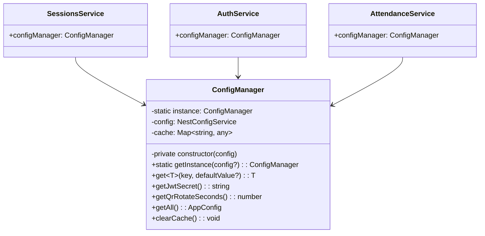

# Singleton Pattern - Mẫu Thiết Kế Singleton

## 1. Giới thiệu Pattern

**Singleton** là mẫu thiết kế thuộc nhóm **Creational** (Khởi tạo), đảm bảo rằng một class chỉ có duy nhất một instance và cung cấp một điểm truy cập toàn cục đến instance đó. Pattern này đặc biệt hữu ích khi cần một đối tượng được chia sẻ trên toàn ứng dụng.

---

## 2. Bối cảnh áp dụng

Trong hệ thống QR Attendance, có nhiều cấu hình cần được quản lý tập trung:
- JWT_SECRET - Khóa ký JWT
- QR_ROTATE_SECONDS - Thời gian hiệu lực QR
- GEOCODING_API_KEY - API key cho geocoding
- EMAIL_CONFIG - Cấu hình email
- REDIS_URL - Redis connection

Mỗi service cần access这些配置, dẫn đến việc inject ConfigService nhiều lần.

---

## 3. Code Cũ (Không dùng Singleton)

**File:** `src/sessions/sessions.service.ts`

```typescript
@Injectable()
export class SessionsService {
  constructor(
    private config: ConfigService,  // Inject nhiều lần
    private prisma: PrismaService,
    private qrCodeService: QRCodeService
  ) {}

  async generateQRCode(sessionId: string) {
    const jwtSecret = this.config.get('JWT_SECRET');  // Lấy config
    const rotateSeconds = this.config.get('QR_ROTATE_SECONDS') || 60;
    // ... generate QR
  }

  validateToken(token: string) {
    const jwtSecret = this.config.get('JWT_SECRET');  // Lặp lại
    // ... validate
  }
}

// File khác lại inject ConfigService
@Injectable()
export class AuthService {
  constructor(
    private config: ConfigService,  // Inject lại
    private jwtService: JwtService
  ) {}

  generateToken() {
    const jwtSecret = this.config.get('JWT_SECRET');  // Lặp lại
    // ...
  }
}

// File khác nữa
@Injectable()
export class AttendanceService {
  constructor(
    private config: ConfigService,  // Inject lại
    // ...
  ) {}

  getConfig() {
    const secret = this.config.get('JWT_SECRET');  // Lặp lại
    // ...
  }
}
```

---

## 4. Code Mới (Sử dụng Singleton)

**File:** `src/common/config/config-manager.ts`

```typescript
import { Injectable, OnModuleInit } from '@nestjs/common';
import { ConfigService as NestConfigService } from '@nestjs/config';

// ============ Configuration Types ============
export interface AppConfig {
  jwt: {
    secret: string;
    expiresIn: string;
  };
  qr: {
    rotateSeconds: number;
    format: string;
  };
  geofence: {
    defaultRadius: number;
    maxRadius: number;
  };
  email: {
    host: string;
    port: number;
    user: string;
    password: string;
  };
  database: {
    url: string;
  };
}

// ============ Singleton ConfigManager ============
@Injectable()
export class ConfigManager implements OnModuleInit {
  private static instance: ConfigManager;
  private config: NestConfigService;
  
  // Cached values - tránh đọc nhiều lần
  private cache: Map<string, any> = new Map();

  private constructor(config: NestConfigService) {
    // Prevent multiple instances
    if (ConfigManager.instance) {
      return ConfigManager.instance;
    }
    this.config = config;
    ConfigManager.instance = this;
  }

  // Static factory method - ensures single instance
  static getInstance(config?: NestConfigService): ConfigManager {
    if (!ConfigManager.instance && config) {
      ConfigManager.instance = new ConfigManager(config);
    }
    return ConfigManager.instance;
  }

  onModuleInit() {
    // Pre-load frequently accessed configs
    this.cache.set('jwt.secret', this.get('JWT_SECRET', 'dev-secret-key'));
    this.cache.set('qr.rotateSeconds', this.get('QR_ROTATE_SECONDS', 60));
  }

  // Get config with caching
  get<T>(key: string, defaultValue?: T): T {
    if (this.cache.has(key)) {
      return this.cache.get(key);
    }
    
    const value = this.config.get(key) || defaultValue;
    this.cache.set(key, value);
    return value;
  }

  // ============ JWT Config ============
  getJwtSecret(): string {
    return this.get<string>('JWT_SECRET', 'dev-jwt-secret-change-in-production');
  }

  getJwtExpiresIn(): string {
    return this.get<string>('JWT_EXPIRES_IN', '7d');
  }

  // ============ QR Config ============
  getQrRotateSeconds(): number {
    return this.get<number>('QR_ROTATE_SECONDS', 60);
  }

  getQrFormat(): string {
    return this.get<string>('QR_FORMAT', 'jwt');
  }

  // ============ Geofence Config ============
  getDefaultGeofenceRadius(): number {
    return this.get<number>('DEFAULT_GEOFENCE_RADIUS', 100);
  }

  getMaxGeofenceRadius(): number {
    return this.get<number>('MAX_GEOFENCE_RADIUS', 500);
  }

  // ============ Email Config ============
  getEmailHost(): string {
    return this.get<string>('EMAIL_HOST', 'smtp.gmail.com');
  }

  getEmailPort(): number {
    return this.get<number>('EMAIL_PORT', 587);
  }

  getEmailUser(): string {
    return this.get<string>('EMAIL_USER', '');
  }

  getEmailPassword(): string {
    return this.get<string>('EMAIL_PASSWORD', '');
  }

  // ============ Database Config ============
  getDatabaseUrl(): string {
    return this.get<string>('DATABASE_URL', '');
  }

  // ============ Environment Helpers ============
  isDevelopment(): boolean {
    return this.get<string>('NODE_ENV', 'development') === 'development';
  }

  isProduction(): boolean {
    return this.get<string>('NODE_ENV', 'development') === 'production';
  }

  // ============ Get All Config ============
  getAll(): AppConfig {
    return {
      jwt: {
        secret: this.getJwtSecret(),
        expiresIn: this.getJwtExpiresIn()
      },
      qr: {
        rotateSeconds: this.getQrRotateSeconds(),
        format: this.getQrFormat()
      },
      geofence: {
        defaultRadius: this.getDefaultGeofenceRadius(),
        maxRadius: this.getMaxGeofenceRadius()
      },
      email: {
        host: this.getEmailHost(),
        port: this.getEmailPort(),
        user: this.getEmailUser(),
        password: this.getEmailPassword()
      },
      database: {
        url: this.getDatabaseUrl()
      }
    };
  }

  // ============ Clear Cache ============
  clearCache(): void {
    this.cache.clear();
  }
}

// ============ Module Definition ============
import { Module, Global } from '@nestjs/common';

@Global()
@Module({
  providers: [
    {
      provide: ConfigManager,
      useFactory: (config: NestConfigService) => {
        return ConfigManager.getInstance(config);
      },
      inject: [ConfigService]
    }
  ],
  exports: [ConfigManager]
})
export class ConfigManagerModule {}
```

---

## 5. Cách sử dụng

```typescript
// Trong bất kỳ service nào
import { ConfigManager } from '../common/config/config-manager';

@Injectable()
export class SessionsService {
  constructor(
    private configManager: ConfigManager,  // Chỉ cần inject 1 lần
    private prisma: PrismaService
  ) {}

  async generateQRCode(sessionId: string) {
    const jwtSecret = this.configManager.getJwtSecret();  // Dùng tiện ích
    const rotateSeconds = this.configManager.getQrRotateSeconds();
    
    // Hoặc dùng helper
    const config = this.configManager.getAll();
    console.log(config.jwt.secret);
  }
}

// Trong AuthService
@Injectable()
export class AuthService {
  constructor(private configManager: ConfigManager) {}

  generateToken() {
    const secret = this.configManager.getJwtSecret();
    const expiresIn = this.configManager.getJwtExpiresIn();
    // ...
  }
}

// Kiểm tra môi trường
if (this.configManager.isProduction()) {
  // Production specific logic
}
```

---

## 6. Giải thích tại sao áp dụng Singleton

### Vấn đề gặp phải:
- ConfigService được inject vào mọi service
- Truy cập config không nhất quán
- Khó thay đổi cách đọc config
- Caching không hiệu quả

### Giải pháp Singleton:
- Một instance duy nhất cho toàn app
- Caching tập trung
- API nhất quán để truy cập config
- Dễ dàng thay đổi cách đọc config

---

## 7. Lợi ích của Singleton Pattern

| Tiêu chí | Trước khi dùng Singleton | Sau khi dùng Singleton |
|----------|------------------------|----------------------|
| **Instance** | Nhiều (mỗi service) | Một (toàn app) |
| **Caching** | Không có | Có (Map cache) |
| **API** | Không nhất quán | Nhất quán (typed methods) |
| **Maintenance** | Khó | Dễ |

### Các lợi ích cụ thể:

1. **Global Access**
   - Truy cập từ bất kỳ đâu

2. **Performance**
   - Cache tránh đọc nhiều lần

3. **Consistency**
   - Tất cả config qua một nơi

4. **Easy Changes**
   - Thay đổi cách đọc config ở 1 chỗ

---

## 8. Sơ đồ Class



---

## 9. Kết luận

Singleton Pattern giúp quản lý config tập trung và hiệu quả:

- ✅ Một instance duy nhất cho toàn ứng dụng
- ✅ Cache tập trung, tăng performance
- ✅ API nhất quán, dễ sử dụng
- ✅ Dễ dàng thay đổi cách đọc config

**Khuyến nghị:** Sử dụng Singleton cho các đối tượng cần shared state hoặc config toàn cục.

