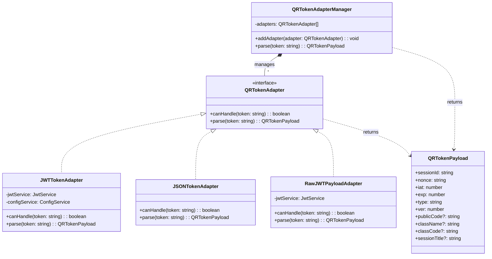

# Adapter Pattern - Mẫu Thiết Kế Adapter

## 1. Giới thiệu Pattern

**Adapter** là mẫu thiết kế thuộc nhóm **Structural** (Cấu trúc), cho phép các interface không tương thích có thể làm việc cùng nhau. Adapter đóng gói interface của một class và cung cấp interface khác mà client mong đợi.

---

## 2. Bối cảnh áp dụng

Trong hệ thống QR Attendance, QR token có thể đến từ nhiều nguồn với định dạng khác nhau:
- **JWT Format** - Token được tạo bằng JWT (phổ biến)
- **JSON Format** - Token là JSON string
- **Raw JWT Payload** - Decode JWT không verify signature

Cần một cơ chế để xử lý tất cả các định dạng này một cách thống nhất.

---

## 3. Code Cũ (Không dùng Adapter)

**File:** `src/attendance/facades/attendance-checkin.facade.ts`

```typescript
async processCheckIn(qrToken: string, lat: number, lng: number) {
  // Cách 1: JWT format
  let qrPayload = this.jwtService.verify(qrToken);
  if (!qrPayload) {
    // Cách 2: JSON format
    try {
      qrPayload = JSON.parse(qrToken);
    } catch {
      // Cách 3: Raw JWT payload
      const parts = qrToken.split('.');
      if (parts.length === 3) {
        qrPayload = decode(parts[1]);
      }
    }
  }

  if (!qrPayload) {
    throw new BadRequestException('Invalid token');
  }
  // ... tiếp tục xử lý
}
```

---

## 4. Code Mới (Sử dụng Adapter)

**File:** `src/common/utils/qr-token-adapter.ts`

```typescript
import { Injectable, BadRequestException } from '@nestjs/common';
import { JwtService } from '@nestjs/jwt';
import { ConfigService } from '@nestjs/config';

export interface QRTokenPayload {
  sessionId: string;
  nonce: string;
  iat: number;
  exp: number;
  type: 'ATTEND_TOKEN';
  ver: number;
  publicCode?: string | null;
  className?: string | null;
  classCode?: string | null;
  sessionTitle?: string | null;
}

/**
 * Interface chuẩn cho các adapter QR token
 */
export interface QRTokenAdapter {
  canHandle(token: string): boolean;
  parse(token: string): QRTokenPayload | null;
}

/**
 * Adapter cho JWT token
 */
@Injectable()
export class JWTTokenAdapter implements QRTokenAdapter {
  constructor(
    private jwtService: JwtService,
    private configService: ConfigService,
  ) {}

  canHandle(token: string): boolean {
    const parts = token.split('.');
    return parts.length === 3;
  }

  parse(token: string): QRTokenPayload | null {
    const secret = this.configService.get('JWT_SECRET') || 'dev_change_me';
    try {
      return this.jwtService.verify<QRTokenPayload>(token, {
        secret,
        clockTolerance: 5,
      });
    } catch {
      return null;
    }
  }
}

/**
 * Adapter cho JSON string token
 */
@Injectable()
export class JSONTokenAdapter implements QRTokenAdapter {
  canHandle(token: string): boolean {
    try {
      const parsed = JSON.parse(token);
      return !!(parsed.sessionId && parsed.nonce);
    } catch {
      return false;
    }
  }

  parse(token: string): QRTokenPayload | null {
    try {
      const parsed = JSON.parse(token);
      if (!parsed.sessionId || !parsed.nonce) {
        return null;
      }

      const now = Math.floor(Date.now() / 1000);
      if (parsed.exp && parsed.exp >= now) {
        return parsed as QRTokenPayload;
      }
      return null;
    } catch {
      return null;
    }
  }
}

/**
 * Adapter cho raw decoded JWT payload (không verify signature)
 */
@Injectable()
export class RawJWTPayloadAdapter implements QRTokenAdapter {
  constructor(private jwtService: JwtService) {}

  canHandle(token: string): boolean {
    const parts = token.split('.');
    return parts.length === 3;
  }

  parse(token: string): QRTokenPayload | null {
    try {
      const parts = token.split('.');
      if (parts.length !== 3) {
        return null;
      }

      const json = Buffer.from(
        parts[1].replace(/-/g, '+').replace(/_/g, '/'),
        'base64',
      ).toString('utf8');

      const decoded = JSON.parse(json);
      const now = Math.floor(Date.now() / 1000);

      if (decoded && decoded.sessionId && decoded.exp && decoded.exp >= now) {
        return decoded as QRTokenPayload;
      }
      return null;
    } catch {
      return null;
    }
  }
}

/**
 * QR Token Adapter Manager - Facade cho việc chọn adapter phù hợp
 */
@Injectable()
export class QRTokenAdapterManager {
  private adapters: QRTokenAdapter[];

  constructor(
    jwtTokenAdapter: JWTTokenAdapter,
    jsonTokenAdapter: JSONTokenAdapter,
    rawJWTPayloadAdapter: RawJWTPayloadAdapter,
  ) {
    // Thứ tự ưu tiên: JWT -> JSON -> Raw
    this.adapters = [jwtTokenAdapter, jsonTokenAdapter, rawJWTPayloadAdapter];
  }

  parse(token: string): QRTokenPayload {
    for (const adapter of this.adapters) {
      if (adapter.canHandle(token)) {
        const result = adapter.parse(token);
        if (result) {
          return result;
        }
      }
    }

    throw new BadRequestException('QR token không hợp lệ hoặc đã hết hạn');
  }

  addAdapter(adapter: QRTokenAdapter): void {
    this.adapters.push(adapter);
  }
}
```

---

## 5. Cách sử dụng

**File:** `src/attendance/facades/attendance-checkin.facade.ts`

```typescript
import { QRTokenPayload, QRTokenAdapterManager } from '../../common/utils/qr-token-adapter';

@Injectable()
export class AttendanceCheckInFacade {
  constructor(
    private prisma: PrismaService,
    private qrTokenAdapterManager: QRTokenAdapterManager,
  ) {}

  async completeCheckIn(
    studentId: string,
    qrToken: string,
    lat: number,
    lng: number,
  ): Promise<CheckInResult> {
    // SỬ DỤNG ADAPTER PATTERN - parse token tự động
    let qrPayload: QRTokenPayload | null;
    try {
      qrPayload = this.qrTokenAdapterManager.parse(qrToken);
    } catch {
      qrPayload = null;
    }

    if (!qrPayload) {
      throw new BadRequestException('QR token không hợp lệ hoặc đã hết hạn');
    }

    // Tiếp tục xử lý...
    const session = await this.getSession(qrPayload.sessionId);
    // ...
  }
}
```

**File:** `src/sessions/sessions.module.ts`

```typescript
import {
  JWTTokenAdapter,
  JSONTokenAdapter,
  RawJWTPayloadAdapter,
  QRTokenAdapterManager,
} from '../common/utils/qr-token-adapter';

@Module({
  providers: [
    JWTTokenAdapter,
    JSONTokenAdapter,
    RawJWTPayloadAdapter,
    QRTokenAdapterManager,
  ],
  exports: [QRTokenAdapterManager],
})
export class SessionsModule {}
```

---

## 6. Giải thích tại sao áp dụng Adapter

### Vấn đề gặp phải:
- Một function xử lý quá nhiều định dạng
- Khó thêm định dạng mới
- Khó test từng định dạng
- Code dài và khó đọc

### Giải pháp Adapter:
- Mỗi adapter xử lý một định dạng
- Manager chọn adapter phù hợp
- Thêm format mới không cần sửa code cũ

---

## 7. Lợi ích của Adapter Pattern

| Tiêu chí | Trước khi dùng Adapter | Sau khi dùng Adapter |
|----------|----------------------|---------------------|
| **Số dòng code** | ~40 dòng trong 1 function | ~10 dòng mỗi adapter |
| **Thêm format** | Sửa function | Thêm Adapter mới |
| **Test** | Khó test | Dễ test từng adapter |
| **Đọc code** | Khó | Dễ dàng |

### Các lợi ích cụ thể:

1. **Single Responsibility**
   - Mỗi adapter lo một định dạng

2. **Open/Closed**
   - Thêm format không sửa code cũ

3. **Dễ test**
   - Test từng adapter độc lập

4. **Dễ mở rộng**
   - Thêm adapter mới dễ dàng

---

## 8. Sơ đồ Class



---

## 9. Kết luận

Adapter Pattern giúp xử lý nhiều định dạng khác nhau một cách thống nhất:

- ✅ Tách biệt rõ ràng từng loại adapter
- ✅ Dễ dàng thêm định dạng mới
- ✅ Code gọn gàng, dễ bảo trì
- ✅ Dễ test từng thành phần

**Khuyến nghị:** Sử dụng Adapter khi hệ thống cần xử lý nhiều định dạng đầu vào khác nhau.
